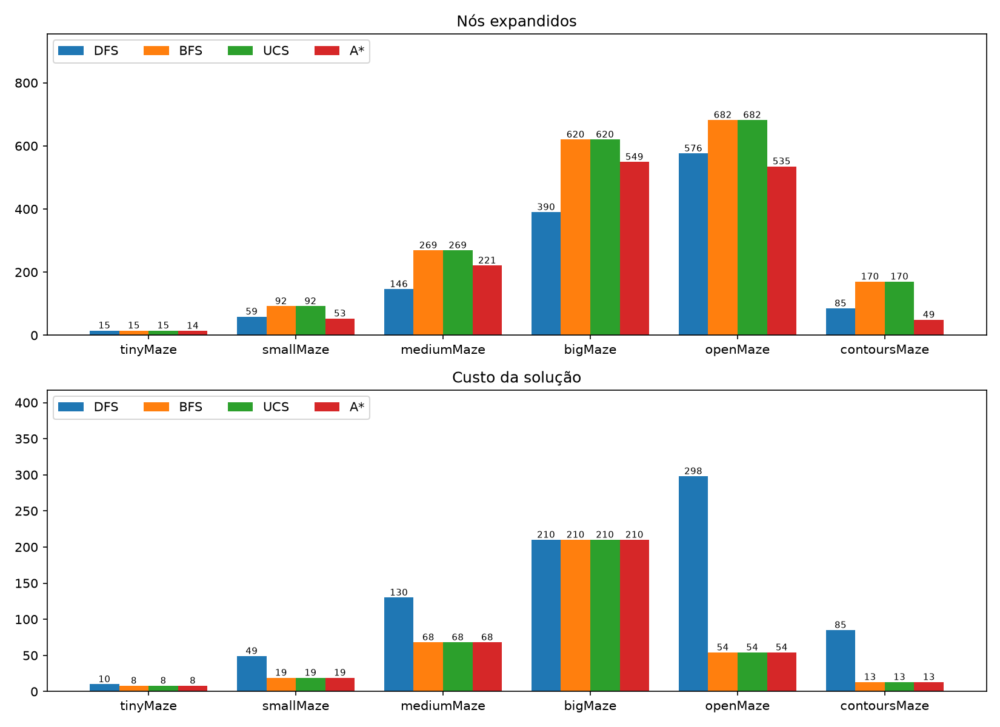
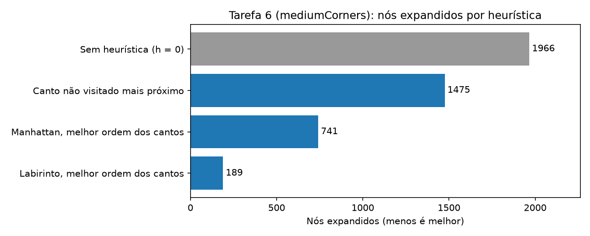
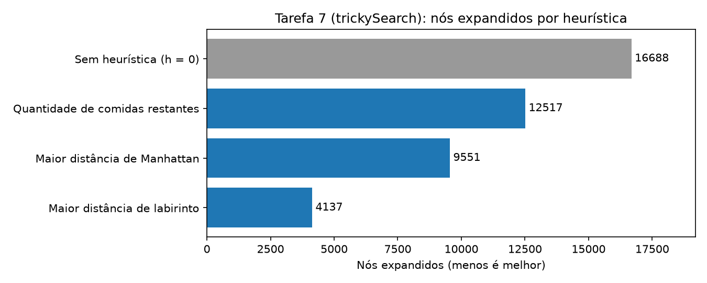

# Trabalho 1 - Pacman: Relatório

## Identificação

Vinícius Bergonzi Lazzari (334056)

## 1. Comparação experimental (Tarefas 1-4)

Todos os algoritmos implementados se tratam de algoritmos de busca em grafo e testam se o objetivo alvo foi encontrado ao analisar o melhor estado candidato na fronteira. A maior diferença entre eles esta na forma de armazenar a fronteira dos estados: DFS usa pilha, BFS usa fila, UCS usa fila de prioridade com custo acumulado e A* usa custo acumulado mais heurística.

Análise:

- BFS, UCS e A* encontram o caminho ótimo em todos os labirintos. Como todos os passos custam 1, BFS e UCS se comportam do mesmo jeito (mesmo custo e mesmo número de nós).
- DFS não é ótimo, no openMaze devolve custo 298 contra 54 (5,5 vezes pior), no contoursMaze 85 contra 13 e no mediumMaze 130 contra 68. No bigMaze o custo coincide (210), mas isso depende do labirinto e não é garantido.
- A* expande menos nós que BFS/UCS em todos os labirintos, porque a heurística direciona a busca ao objetivo de maneira mais eficiente.
- O número de nós do DFS varia conforme o labirinto: ele expandiu menos nós que A* no mediumMaze (146 contra 221) e no bigMaze (390 contra 549), mas mais no tinyMaze, smallMaze, openMaze e contoursMaze (85 contra 49). Porém, menos nós expandidos não significa melhor solução em termos de custo.
- Sobre a ordem de desempenho baseado em qualidade da solução nos testes realizados, A* = UCS = BFS > DFS. Em nós expandidos, A* < BFS = UCS, DFS é difícil de rankear pois varia conforme o labirinto.

## 2. Modelagem de estado (Tarefa 5, Corners)

O estado é composto de uma tupla `(posição, cantosVisitados)`.

- `posição` é composto pelas coordenadas `(x, y)` do Pacman.
- `cantosVisitados` é uma tupla de 4 booleanos, um por canto, na mesma ordem de `problem.corners`. A posição `i` é `True` se o canto `i` já foi visitado.
- O estado inicial é composto pela posição inicial e `(False, False, False, False)`.
- O objetivo final é `all(cantosVisitados == True)`.
- O algoritmo para sucessores é: para cada movimento legal, a nova posição é calculada. Se ela for um canto ainda não visitado, uma nova tupla `cantosVisitados` é criada com essa posição marcada como `True`. Caso contrário, a tupla antiga é reaproveitada. Custo 1 por passo.

## 3. Heurísticas (Tarefas 6 e 7)

### Tarefa 6: cornersHeuristic

Para esse problema, foi utilizada uma heurística que calcula a menor a menor soma das distâncias de Manhattan para percorrer todos eles, calculando todas permutações possíveis (no máximo 4! = 24). A ideia é que essa heurística daria uma boa estimativa do custo mínimo para visitar todos quatro cantos e como são poucas permutações, é rápido o suficiente para utilizar como heurística.

Admissibilidade: considerar as paredes só pode aumentar o caminho real, então a distância de Manhattan nunca é maior que a distância real no labirinto. O valor retornado é o custo ótimo para o problema relaxado (sem considerar as paredes), e o custo real de visitar todos os cantos restantes não pode ser menor que ele. Quando todos os cantos foram visitados, retorna 0. Resultado no mediumCorners: 741 nós expandidos.

Heurísticas testadas no mediumCorners (A*, custo da solução 106 em todos os casos):

A primeira tentativa considerava apenas o canto não visitado mais próximo, o que ignorava os outros cantos e por isso é mais fraca. Testar todas as ordens de visita aproxima muito mais a heurística do custo real. Usar a distância de labirinto (BFS a partir de cada canto, calculada uma vez) reduz ainda mais os nós, porém é significativamente mais lenta para achar uma solução, apesar de expandir menor nós, pois a função heurística é muito custosa, por isso a versão com permutações e distância de Manhattan foi mantida como final.

### Tarefa 7: foodHeuristic

A heurística escolhida é a maior distância de labirinto (calculada com um algoritmo BFS com `mazeDistance`) da posição do Pacman até qualquer comida restante. Os resultados são guardados em `problem.heuristicInfo`, indexados por `(posição, comida)`, como cache, uma vez que o cálculo de uma posição até uma comida pode repetir várias vezes durante o algoritmo. Essa estratégia de memoization melhorou muito o desempenho final do algoritmo.

Admissibilidade: o Pacman precisa comer todas as comidas, inclusive a mais distante, então o custo real é no mínimo a distância de labirinto até ela. Como a distância usada já considera as paredes, ela nunca vai superestimar a distância necessária. Quando não existe mais comida no tabuleiro, retorna 0. A heurística também é consistente: um passo altera a distância a qualquer ponto fixo em no máximo 1.

Impacto no trickySearch (nós expandidos, custo da solução 60):

### Tarefa 8

`AnyFoodSearchProblem.isGoalState` retorna verdadeiro em qualquer posição com comida, e `findPathToClosestDot` usa BFS. Como todos os passos custam 1, a primeira comida encontrada é uma das mais próximas. A estratégia é greedy pois cada trecho é ótimo, mas o caminho total pode não ser.

## 4. Declaração do uso de IA

Foi utilizado o Claude (Anthropic), via Claude Chat, durante o desenvolvimento. O uso incluiu:

- explicações de conceitos (DFS/BFS/UCS/A*, heurísticas admissíveis, consistentes, modelagem de estado).
- ideias iniciais para cada questão, sobre ideias de heurísticas e confirmação de admissibilidade e consistência.
- revisão de código e ideias de otimização (por exemplo uso da cache para a tarefa 7).
- geração de gráficos de comparação para o relatório.
- revisão do relatório final e simplificação de texto.
